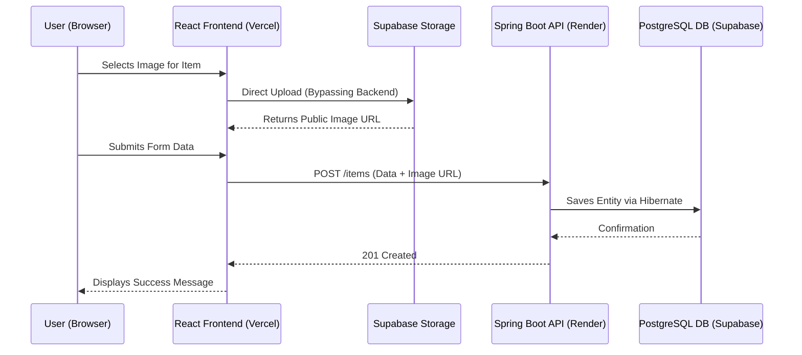

# TraceBack - Lost and Found Platform

TraceBack is a modern, full-stack web application designed to help communities report and reclaim lost items. The platform features secure authentication, direct-to-cloud image uploads, and an administrative workflow for resolving ownership claims.

---

## 🚀 Tech Stack

### Frontend
*   **Framework:** React 19 + Vite
*   **Styling:** Modern Vanilla CSS (Glassmorphism, Responsive UI)
*   **HTTP Client:** Axios
*   **Cloud SDK:** Supabase JS (for direct storage uploads)
*   **Deployment:** Vercel

### Backend
*   **Language:** Java 21
*   **Framework:** Spring Boot 3.3.5
*   **Security:** Spring Security with stateless JWT Authentication
*   **ORM:** Spring Data JPA / Hibernate
*   **Deployment:** Render (via Docker)

### Cloud Infrastructure
*   **Database:** PostgreSQL (Hosted on Supabase)
*   **Image Storage:** Supabase Storage (Public `items` bucket)

---

## ✨ Key Features

1.  **Secure Authentication:** JWT-based login/registration system with `ROLE_USER` and `ROLE_ADMIN` distinctions.
2.  **Item Directory:** Users can report items as `LOST` or `FOUND`, complete with category tags, date tracking, and location logging.
3.  **Direct-to-Cloud Uploads:** Images are securely uploaded directly from the React frontend to Supabase, bypassing the Java backend to reduce server load.
4.  **Claim Workflow:** Users can submit claims with proof of ownership for found items.
5.  **Admin Moderation:** Admins can review claims, approve/reject them, and manage the database.

---

## 🏗️ Architecture & Flow

### High-Level Workflow
1. **Frontend (React):** Handles the UI, routing, and user state.
2. **Authentication:** User logs in via the React app. Spring Boot verifies credentials and returns a secure JWT token.
3. **Image Upload:** When reporting an item, the React frontend uploads the image *directly* to a Supabase Storage Bucket, receiving a public URL in return. (This saves backend bandwidth).
4. **Data Storage:** The frontend sends the item metadata (including the Supabase image URL) to the Spring Boot REST API.
5. **Database:** Spring Boot saves the metadata securely in the Supabase PostgreSQL database using Hibernate.



### Database Entities
*   **User:** Contains authentication credentials, roles (`ROLE_USER`, `ROLE_ADMIN`), and contact information.
*   **Item:** Represents a `LOST` or `FOUND` object, linked to the User who reported it. Contains categorical tags and status.
*   **Claim:** A formal request by a User to claim a `FOUND` Item, including written proof of ownership.

### Folder Structure
```text
TraceBack/
├── frontend/                 # React Web Application
│   ├── src/
│   │   ├── api/              # Axios configurations & endpoints
│   │   ├── components/       # Reusable UI components (Navbar, ItemCard)
│   │   ├── context/          # React Context (Global Auth state)
│   │   └── pages/            # View components (Dashboard, AdminPortal, etc.)
│   └── package.json
└── backend/                  # Spring Boot REST API
    ├── src/main/java/.../backend/
    │   ├── config/           # CORS & Security Filters
    │   ├── controller/       # REST API Endpoints
    │   ├── dto/              # Data Transfer Objects (Payload shapes)
    │   ├── model/            # JPA Database Entities
    │   ├── repository/       # Spring Data JPA Interfaces
    │   ├── security/         # JWT Generation and Validation
    │   └── service/          # Core Business Logic
    ├── Dockerfile            # Render Deployment Config
    └── pom.xml
```

---

## 🛠️ Local Development Setup

### 1. Database & Cloud Setup (Supabase)
1. Create a project on [Supabase](https://supabase.com).
2. Create a public storage bucket named `items`.
3. Set an **RLS Policy** on the `storage.objects` table allowing `INSERT` for the `items` bucket.
4. Enable RLS on your auto-generated `users`, `items`, and `claims` tables (with no policies) to lock down the PostgREST API.

### 2. Backend Configuration
Create a `.env` file in the `backend/` directory:
```env
DB_URL=jdbc:postgresql://<your-supabase-db-url>:5432/postgres?sslmode=require
DB_USERNAME=postgres.<your-project-id>
DB_PASSWORD=<your-db-password>
JWT_SECRET=<your-very-long-secret-key-base64>
```

Start the Spring Boot server:
```bash
cd backend
./mvnw clean spring-boot:run
```

### 3. Frontend Configuration
Create a `.env` file in the `frontend/` directory:
```env
VITE_SUPABASE_URL=https://<your-project-id>.supabase.co
VITE_SUPABASE_ANON_KEY=<your-anon-key>
VITE_API_URL=http://localhost:8080
```

Start the React development server:
```bash
cd frontend
npm install
npm run dev
```

---

## 🌐 Production Deployment

*   **Backend (Render):** Set the Root Directory to `backend` and runtime to **Docker**. Add the backend environment variables in the Render dashboard. Set `FRONTEND_URL` to your Vercel URL to enable CORS.
*   **Frontend (Vercel):** Set the Framework to Vite, the Root Directory to `frontend`, and inject the Supabase keys and the `VITE_API_URL` (pointing to the live Render backend) in the Vercel dashboard.

---
*Built with ❤️ using Spring Boot and React.*
